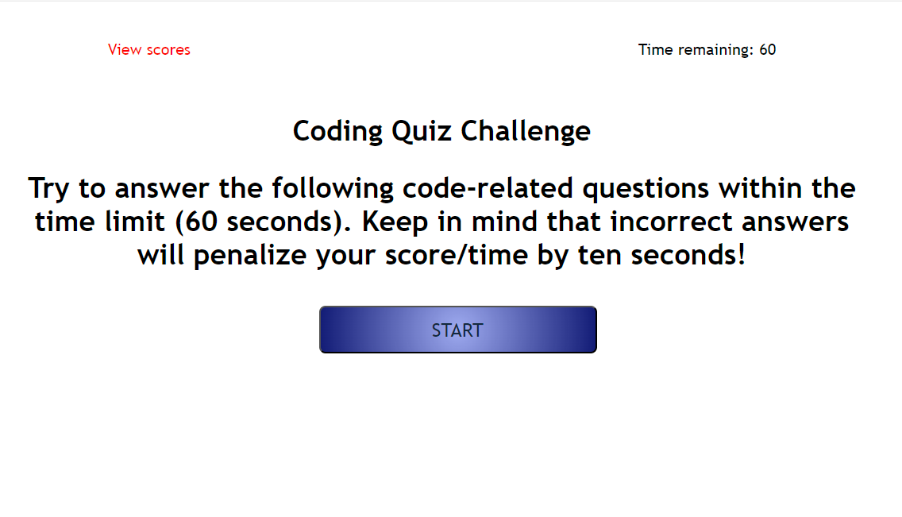
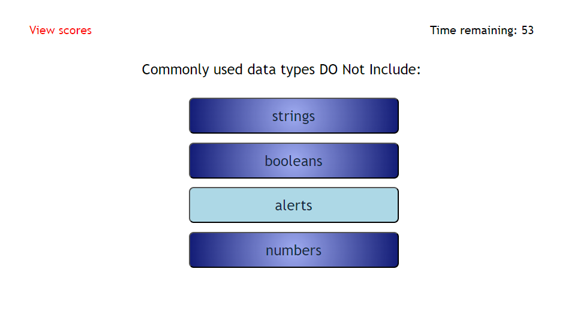
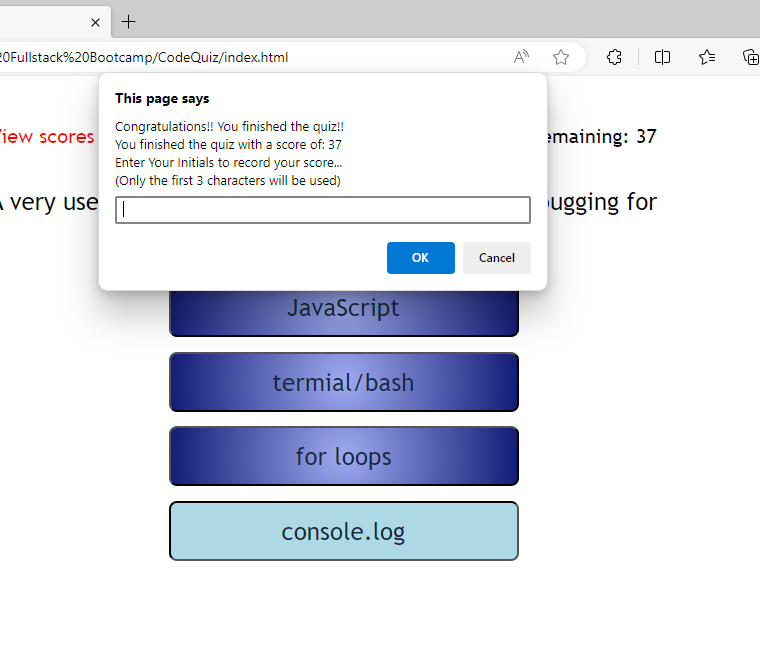
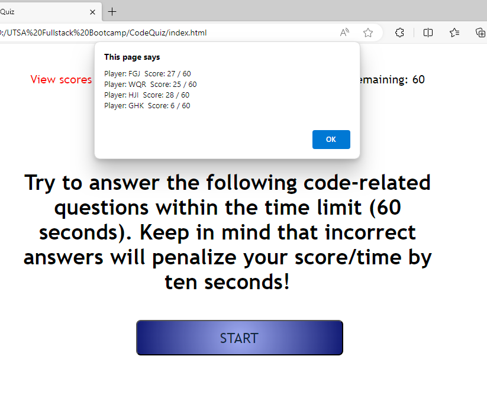
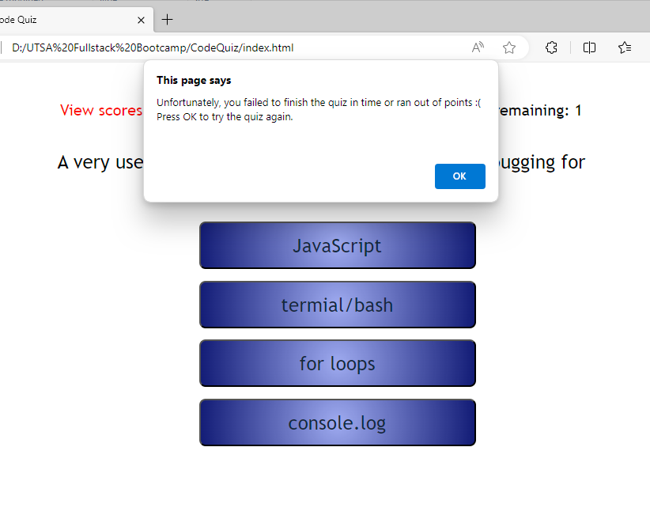

# Coding Quiz

This project is based on using Javascript to ask a user to take a timed quiz and store the information if they are successful.

## Table of Contents

- [About](#about)
- [Getting Started](#getting_started)
- [Installing](#installing)
- [Usage](#usage)
- [Screenshots](#screenshots)
- [Includes](#includes)
- [Contributing](#contributing)

## About

 - This javascript app/function will create a random password from 8 to 128 characters involving uppercase and lowercase letters, special characters, and numeric values. All or one but none will not work.
 - This app will ask the user to take a coding quiz and if they finish in time they will be able to add their name to the scores list (even if zero because they got the last answer wrong) but still technically finished the quiz.
 - The app starts with 60 seconds and has a penalty of 10 seconds per wrong answer.

## Getting Started

Just click the "Start" button and follow the directions/prompts to start another testing session.
Click the "View Scores" option top left screen to see session scores

## Installing

No installation necessary.

## Usage

This can be used to test your knowledge on coding standards and practices/information. A 10 second dent for getting the question wrong will add up quickly!! Do your research but don't rush your answer...

## Screenshots

## Includes

This code uses jQuery and the following source (src) "https://code.jquery.com/jquery-3.5.1.min.js"

## Contributing

Clinton Scheible
- UTSA Bootcamp
- Challenge 4

